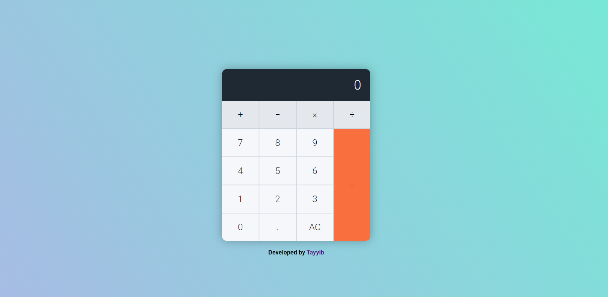

<h1 style="text-align: center, background-color: orange; color: black;">EASY USE CALCULATOR</h1>

<h3>You Can Perform The Folling operations!</h3>
<ul>
  <li>Addition</li>
  <li>Substraction</li>
  <li>Multipication</li>
  <li>Division</li>
  <li>Decimal</li>
</ul>

You can also clear your calculatons as well.

<h3>Use the link below to preview Live Demo</h3>
<h1> <a href="https://eazy-calculator.netlify.app/" target="_blink">View Live Demo</a></h1>
